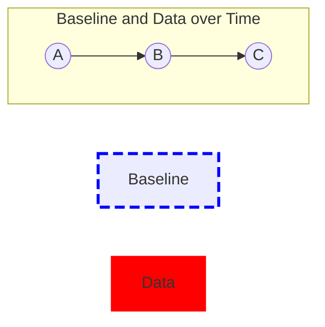

# MPR121 Baseline System

## INTRODUCTION

Touch acquisition takes a few different parts of the system in order to detect touch. The baseline filter and touch detection are tightly coupled. The purpose of the baseline filter is to “filter out touches” resulting in a system that is similar to a long term average but also takes into account that one specific signature. A touch must have different properties than noise and environmental change with respect to the filter response. This is accomplished through four register types that operate under different conditions. These are Max Half Delta (MHD), Noise Half Delta (NHD), Noise Count Limit (NCL) and Filter Delay Limit (FDL).

<table>
  <tr>
    <td colspan="4" style="text-align:center;"><b>AFE AQUISITION</b></td>
  </tr>
<tr>
    <td style="text-align:center;"><b>RAW DATA</b></td>
    <td style="text-align:center;"><b>1st FILTER</b></td>
    <td style="text-align:center;"><b>2nd FILTER</b></td>
    <td style="text-align:center;"><b>BASELINE FILTER</b></td>
  </tr>
<tr>
    <td style="text-align:center;">1 - 32 μs</td>
    <td style="text-align:center;">1 - 128 μs</td>
    <td style="text-align:center;">4 - 2048 μs</td>
    <td></td>
  </tr>
<tr>
    <td colspan="4" style="text-align:center;">
      <b>TOUCH</b>
    </td>
  </tr>
<tr>
    <td colspan="4" style="text-align:center;">
      <b>STATUS REGISTER</b>
    </td>
  </tr>
<tr>
    <td colspan="4" style="text-align:center;">
      <b>IRQ</b>
    </td>
  </tr>
</table>

**Figure 1. Data Flow in the MPR121**

---

# MAX HALF DELTA (NHD)

<table>
  <thead>
    <tr>
      <th></th>
      <th>7</th>
      <th>6</th>
      <th>5</th>
      <th colspan="3">4</th>
      <th>3</th>
      <th colspan="3">2</th>
      <th>1</th>
      <th>0</th>
    </tr>
  </thead>
  <tbody>
    <tr>
      <td>R</td>
      <td>0</td>
      <td>0</td>
      <td colspan="9"></td>
      <td colspan="2" rowspan="2" style="text-align:center;">MHD</td>
    </tr>
<tr>
      <td>W</td>
      <td colspan="11" style="background-color:#b0b0b0;"></td>
    </tr>
<tr>
      <td>Reset:</td>
      <td>0</td>
      <td>0</td>
      <td>0</td>
      <td colspan="3">0</td>
      <td>0</td>
      <td colspan="3">0</td>
      <td>0</td>
      <td>0</td>
    </tr>
<tr>
      <td colspan="13" style="background-color:#b0b0b0;">= Unimplemented</td>
    </tr>
  </tbody>
</table>

<table>
  <thead>
    <tr>
      <th>Field</th>
      <th>Description</th>
    </tr>
  </thead>
  <tbody>
    <tr>
      <td>5:0 MHD</td>
      <td>
        Max Half Delta – The Max Half Delta determines the largest magnitude of variation to pass through the third level filter. 
        000000 DO NOT USE THIS CODE 
        000001 Encoding 1 – Sets the Max Half Delta to 1 
        ~ 
        111111 Encoding 63 – Sets the Max Half Delta to 63
      </td>
    </tr>
  </tbody>
</table>

# NOISE HALF DELTA (NHD)

<table>
  <thead>
    <tr>
      <th></th>
      <th>7</th>
      <th>6</th>
      <th>5</th>
      <th colspan="3">4</th>
      <th>3</th>
      <th colspan="3">2</th>
      <th>1</th>
      <th>0</th>
    </tr>
  </thead>
  <tbody>
    <tr>
      <td>R</td>
      <td>0</td>
      <td>0</td>
      <td colspan="9"></td>
      <td colspan="2" rowspan="2" style="text-align:center;">NHD</td>
    </tr>
<tr>
      <td>W</td>
      <td colspan="11" style="background-color:#b0b0b0;"></td>
    </tr>
<tr>
      <td>Reset:</td>
      <td>0</td>
      <td>0</td>
      <td>0</td>
      <td colspan="3">0</td>
      <td>0</td>
      <td colspan="3">0</td>
      <td>0</td>
      <td>0</td>
    </tr>
<tr>
      <td colspan="13" style="background-color:#b0b0b0;">= Unimplemented</td>
    </tr>
  </tbody>
</table>

> **Figure 2. Noise Half Delta Register**

<table>
  <thead>
    <tr>
      <th>Field</th>
      <th>Description</th>
    </tr>
  </thead>
  <tbody>
    <tr>
      <td>5:0 NHD</td>
      <td>
        Noise Half Delta – The Noise Half Delta determines the incremental change when non-noise drift is detected. 
        000000 DO NOT USE THIS CODE 
        000001 Encoding 1 – Sets the Noise Half Delta to 1 
        ~ 
        111111 Encoding 63 – Sets the Noise Half Delta to 63
      </td>
    </tr>
  </tbody>
</table>

---

# NOISE COUNT LIMIT (NCL)

<table>
  <thead>
    <tr>
      <th colspan="8">7</th>
      <th colspan="8">6</th>
      <th colspan="8">5</th>
      <th colspan="8">4</th>
      <th colspan="8">3</th>
      <th colspan="8">2</th>
      <th colspan="8">1</th>
      <th colspan="8">0</th>
    </tr>
  </thead>
  <tbody>
    <tr>
      <td colspan="8">R</td>
      <td colspan="56" rowspan="2" style="text-align:center;">NCL</td>
      <td colspan="8">W</td>
    </tr>
<tr>
      <td colspan="8" style="text-align:center;">Reset:</td>
      <td colspan="8" style="text-align:center;">0</td>
      <td colspan="8" style="text-align:center;">0</td>
      <td colspan="8" style="text-align:center;">0</td>
      <td colspan="8" style="text-align:center;">0</td>
      <td colspan="8" style="text-align:center;">0</td>
      <td colspan="8" style="text-align:center;">0</td>
      <td colspan="8" style="text-align:center;">0</td>
      <td colspan="8" style="text-align:center;">0</td>
    </tr>
<tr>
      <td colspan="64" style="background-color:#b0b0b0; text-align:center;">= Unimplemented</td>
    </tr>
  </tbody>
</table>

> **Figure 3. Noise Count Limit Register**

<table>
  <thead>
    <tr>
      <th>Field</th>
      <th>Description</th>
    </tr>
  </thead>
  <tbody>
    <tr>
      <td>7:0 NCL</td>
      <td>
        Noise Count Limit – The Noise Count Limit determines the number of samples consecutively greater than the Max Half Delta necessary before it can be determined that it is non-noise. 
        00000000 Encoding 0 – Sets the Noise Count Limit to 1 (every time over Max Half Delta) 
        00000001 Encoding 1 – Sets the Noise Count Limit to 2 consecutive samples over Max Half Delta 
        ~ 
        11111111 Encoding 255 – Sets the Noise Count Limit to 255 consecutive samples over Max Half Delta
      </td>
    </tr>
  </tbody>
</table>

# FILTER DELAY LIMIT (FDL)

<table>
  <thead>
    <tr>
      <th colspan="8">7</th>
      <th colspan="8">6</th>
      <th colspan="8">5</th>
      <th colspan="8">4</th>
      <th colspan="8">3</th>
      <th colspan="8">2</th>
      <th colspan="8">1</th>
      <th colspan="8">0</th>
    </tr>
  </thead>
  <tbody>
    <tr>
      <td colspan="8">R</td>
      <td colspan="56" rowspan="2" style="text-align:center;">FDL</td>
      <td colspan="8">W</td>
    </tr>
<tr>
      <td colspan="8" style="text-align:center;">Reset:</td>
      <td colspan="8" style="text-align:center;">0</td>
      <td colspan="8" style="text-align:center;">0</td>
      <td colspan="8" style="text-align:center;">0</td>
      <td colspan="8" style="text-align:center;">0</td>
      <td colspan="8" style="text-align:center;">0</td>
      <td colspan="8" style="text-align:center;">0</td>
      <td colspan="8" style="text-align:center;">0</td>
      <td colspan="8" style="text-align:center;">0</td>
    </tr>
<tr>
      <td colspan="64" style="background-color:#b0b0b0; text-align:center;">= Unimplemented</td>
    </tr>
  </tbody>
</table>

> **Figure 4. Filter Delay Limit Register**

<table>
  <thead>
    <tr>
      <th>Field</th>
      <th>Description</th>
    </tr>
  </thead>
  <tbody>
    <tr>
      <td>7:0 FDL</td>
      <td>
        Filter Delay Limit – The Filter Delay Limit determines the rate of operation of the filter. A larger number makes it operate slower. 
        00000000 Encoding 0 – Sets the Filter Delay Limit to 1 
        00000001 Encoding 1 – Sets the Filter Delay Limit to 2 
        ~ 
        11111111 Encoding 255 – Sets the Filter Delay Limit to 255
      </td>
    </tr>
  </tbody>
</table>

Additionally there are different conditions in the system that affects how these registers operate. These are rising data, falling data or touched data. When the data changes between these conditions, the current filter process is cancelled and all filter counters return to zero.

The operation of the filter is in the relationship between the 2nd filter data and the baseline filter value. The occurrence of a touch will also change the operation of the system. The touch generation process is described in the application note AN3892.

The falling data system is enabled any time the 2nd filter data is less than the baseline filter data. The rising data system is enabled any time the 2nd filter data is greater than the baseline filter data. The following cases describe the baseline system when it is not changing between the three states mentioned above.

---

# Case 1

Small incremental changes to the system represent long term slow (environmental) changes in the system. The MHD setting regulates this case by allowing any data that is less than two times the MHD to pass the filter. Thus, if the baseline is 700 and the data is 701 with a MHD of one, then the baseline filter would increase to equal the data for the next cycle.

<table>
  <thead>
    <tr>
      <th colspan="15">MHD = 1</th>
    </tr>
  </thead>
  <tbody>
    <tr>
      <td colspan="15" style="text-align:center;">
        <b>Baseline</b> (blue dashes) and <b>Data</b> (red dots) plotted on a grid.
      </td>
    </tr>
<tr>
      <td colspan="15" style="text-align:center;">
        The baseline starts low, gradually increases, plateaus, then decreases back to the initial level. Data points closely follow the baseline with minor deviations.
      </td>
    </tr>
  </tbody>
</table>

**Figure 5. Max Half Delta**

# Case 2

Changes that are larger than double the MHD are regarded as noise and accounted for by the values of the NHD and NCL. Any data outside the MHD is rejected by the filter however sequential values that fall into this category are counted and if enough sequential data exists then the baseline will be adjusted.

In this case, the NCL regulates how many sequential data points must be seen before the data is changed. When the count is reached, the baseline is incremented by the NHD.

<table>
  <thead>
    <tr>
      <th colspan="15">MHD = 1</th>
    </tr>
<tr>
      <th colspan="15">NCL = 3</th>
    </tr>
<tr>
      <th colspan="15">NHD = 1</th>
    </tr>
  </thead>
  <tbody>
    <tr>
      <td colspan="15" style="text-align:center;">
        <b>Baseline</b> (blue dashes) and <b>Data</b> (red dots) plotted on a grid.
      </td>
    </tr>
<tr>
      <td colspan="15" style="text-align:center;">
        Data points show a sequence of three counts outside the baseline, then the baseline increments by NHD, after which Case 1 behavior resumes.
      </td>
    </tr>
<tr>
      <td colspan="5" style="text-align:center;">3 counts</td>
      <td colspan="5" style="text-align:center;">3 counts</td>
      <td colspan="5" style="text-align:center;">NHD added to baseline</td>
    </tr>
<tr>
      <td colspan="15" style="text-align:center;">Case 1 comes into effect</td>
    </tr>
  </tbody>
</table>

**Figure 6.**

# Case 3

When the data is inconsistent but greater than double than MHD the baseline will not vary. Each time a transition takes place, the filter counters are reset, thus the fact that the data is oscillating around the baseline means that the noise is rejected and the baseline will not vary.

<table>
  <thead>
    <tr>
      <th colspan="15">MHD = 1</th>
    </tr>
<tr>
      <th colspan="15">NCL = 3</th>
    </tr>
<tr>
      <th colspan="15">NHD = 1</th>
    </tr>
  </thead>
  <tbody>
    <tr>
      <td colspan="15" style="text-align:center;">
        <b>Baseline</b> (blue dashes) and <b>Data</b> (red dots) plotted on a grid.
      </td>
    </tr>
<tr>
      <td colspan="15" style="text-align:center;">
        Data points oscillate inconsistently around the baseline with values greater than double the MHD but less than NCL counts, causing the baseline to remain unchanged.
      </td>
    </tr>
<tr>
      <td colspan="7" style="text-align:center;">2 &lt; NCL</td>
      <td colspan="8" style="text-align:center;">1 &lt; NCL</td>
    </tr>
<tr>
      <td colspan="7" style="text-align:center;">2 &lt; NCL</td>
      <td colspan="8" style="text-align:center;">1 &lt; NCL</td>
    </tr>
  </tbody>
</table>

**Figure 7.**

---

# Case 4

Low frequency changes to the data can trick the filter in some instances. The FDL is also available to slow down the overall system. This is done by taking an average of the specified number of values before running them through the baseline filter.

<table>
<thead>
<tr>
<th colspan="10">Figure 8.</th>
</tr>
</thead>
<tbody>
<tr>
<td colspan="10" style="text-align:center;">
Red dots represent Data points. 
Circles represent Averaged Data points. 
The diagram shows red data points on a grid with arrows pointing to averaged data points below, illustrating how averaging is done.
</td>
</tr>
</tbody>
</table>

After this averaging the filter reacts to Cases 1, 2, and 3.

<table>
<thead>
<tr>
<th colspan="15">Figure 9.</th>
</tr>
</thead>
<tbody>
<tr>
<td>MHD = 1</td>
<td>NCL = 3</td>
<td>FDL = 4</td>
<td colspan="12"></td>
</tr>
<tr>
<td colspan="3"></td>
<td colspan="3" style="text-align:center;">Case 1</td>
<td colspan="6" style="text-align:center;">Case 2</td>
<td colspan="3" style="text-align:center;">Case 1</td>
</tr>
<tr>
<td colspan="15" style="text-align:center;">
Blue dashed line represents Baseline. 
Red dots represent Data. 
Circles represent Averaged Data. 
The graph shows data points fluctuating with baseline adjustments reacting to the cases.
</td>
</tr>
</tbody>
</table>

---

# ADVANCED CASES

With an understanding of the basic cases, more advanced cases can be discussed. In a touch sensor system, we can take advantage of some known properties to improve the functionality of the filter. These include direction of change, touch occurrence and the rate of touch. The first four cases are still utilized but more functionality is added. The following cases described how different settings are useful as opposed to what exactly the settings do, like cases 1-4.

## Case 5

The direction of change for a touch in the system is always negative. Thus the system takes advantage of this by allowing for varying parameters for different directions of change. Since a touch can only be in the decreasing direction, it is usually best to set the decreasing filter to be slower than the increasing one. This allows for automatic recovery from a bad baseline reading.

- **A.** As the touch occurs, the baseline is decreased slowly due to a non solid touch, but due to the slow reaction, a touch is still detected.
- **B.** The baseline quickly snaps back to the initial value by having fast filtering in the positive direction.
- **C.** The repeated touch is easily handled since the baseline quickly adjusted; if it was slow, the second touch would have resulted in a possible false negative for a touch detection.

**Figure 10.**

## Case 6

The system needs the capability to handle environment changes that appear very similar to actual touches. In Case 5, the touch was a real touch, but slow enough that initially it is thought better for the baseline not to change at all.

- **A.** The decrease is the interface being cleared with a wet rag, causing a relatively slow capacitance change. The baseline accurately tracks this slow change.
- **B.** The baseline begins to increase as the interface becomes dry.
- **C.** A delta from the new baseline allows a touch to be accurately detected.

**Figure 11.**

---

# Case 7

This case is when a touch is occurring. While the baseline system does not detect a touch, it is obviously an important part of the process. The baseline can be set to slowly calibrate a touch from the system preventing keys from becoming stuck. Only the NHD, NCL and FDL are necessary since the value can never be less than double the MHD.

<table>
<thead>
<tr>
  <th colspan="15" style="text-align:center;">Baseline (blue dashed line) and Data (red dots)</th>
</tr>
</thead>
<tbody>
<tr>
  <td colspan="5" style="border-bottom: 2px dotted red;">A</td>
  <td colspan="4" style="border-bottom: 2px dotted red;"></td>
  <td colspan="3" style="border-bottom: 2px dotted red;">B</td>
  <td colspan="3" style="border-bottom: 2px dotted red;">C</td>
</tr>
<tr>
  <td colspan="15" style="border-bottom: 1px solid black;">(Graph showing baseline and data points with annotations A, B, C)</td>
</tr>
</tbody>
</table>

* A. The touch is detected which disengages the increasing/decreasing baseline filter but leaves it enabled with very slow filtering  
* B. Even though the touch has not been released it times out and is eventually rejected.  
* C. Normal baseline filter is engaged.

**Figure 12.**

# Case 8

This case can also prevent keys from being stuck due to misuse. For example, if a metal pen touches a button, this may initially engage the button but the pen is calibrated out over time and normal function resumes. The same applies to water, food humid environments and other instances that generate capacitance change.

<table>
<thead>
<tr>
  <th colspan="5" style="text-align:center;">Baseline (blue dashed line) and Data (red dots)</th>
</tr>
</thead>
<tbody>
<tr>
  <td colspan="3" style="border-bottom: 2px dotted red;">A</td>
  <td colspan="4" style="border-bottom: 2px dotted red;">B</td>
  <td colspan="5" style="border-bottom: 2px dotted red;">C</td>
</tr>
<tr>
  <td colspan="12" style="border-bottom: 1px solid black;">(Graph showing baseline and data points with annotations A, B, C)</td>
</tr>
</tbody>
</table>

* A. Valid normal touch  
* B. False touch filtered out  
* C. Touch from new adjusted baseline  

**Figure 13.**

---

